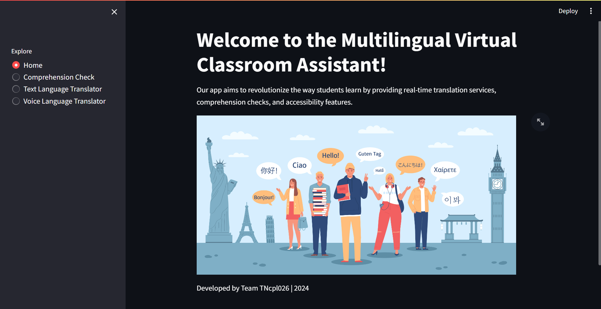
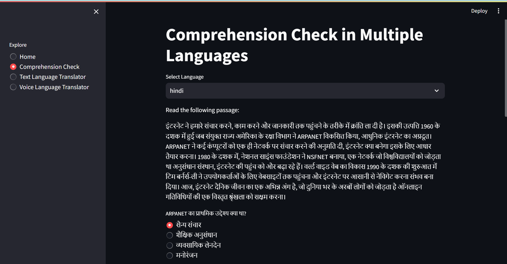
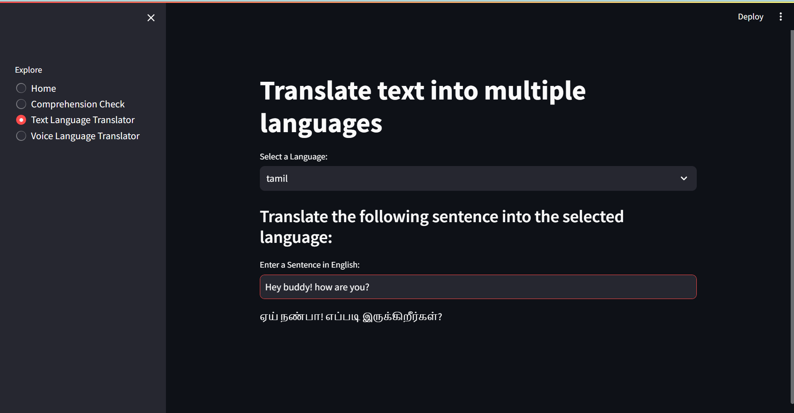
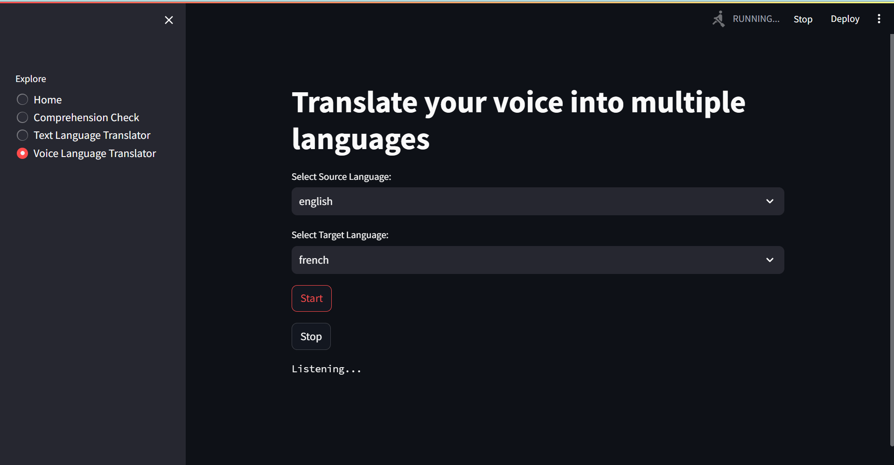

# Language Translation App

This app allows you to translate text and voice inputs from one language to another. It utilizes various APIs for translation and speech recognition to provide a seamless experience for users.



## Features
- Comprehension checks in multiple languages.
  
- Translate text from one language to another.
- 
- Translate voice inputs to text and then to the desired language.
- 
- Supports a wide range of languages for translation.

## Setup
1. Clone the repository:
   ```bash
   git clone https://github.com/selcia25/streamlit-language.git
   ```
2. Install dependencies:
   ```bash
   pip install -r requirements.txt
   ```
3. Run the application:
   ```bash
   python app.py
   ```

## Usage
1. Enter text in the input box and select the source and target languages for translation.
2. Click the "Translate" button to see the translated text.
3. To translate voice inputs, click the microphone button and speak. The app will convert your speech to text and then translate it.

## License
This project is licensed under the MIT License - see the LICENSE.md file for details.
